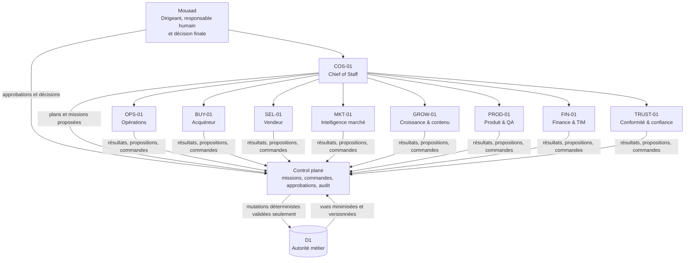

# Organisation agentique LEVOIS

Statut : architecture cible documentaire. Aucun agent, connecteur, workflow ou droit décrit ici n’est actif.

## 1. Mandat d’organisation

LEVOIS reste une entreprise dirigée par Mouaad. L’organisation agentique sert une seule North Star : provoquer une conversation humaine qualifiée avec assez de contexte pour avancer réellement. Elle ne constitue ni une hiérarchie autonome, ni un substitut à la relation client.

La V1 comporte **neuf rôles logiques exactement**. Un rôle logique est un contrat de responsabilité ; il ne suppose ni neuf processus permanents ni neuf modèles différents. Une même exécution isolée pourra ultérieurement charger le contrat du rôle nécessaire. Cette sobriété est adaptée à un portefeuille de 5 à 20 dossiers.

Principes non négociables :

- Mouaad détient la vision, la relation, la responsabilité professionnelle et la décision finale ;
- D1 demeure l’autorité métier opérationnelle ;
- aucun agent n’écrit directement dans un agrégat D1 : il émet une proposition ou une commande typée vers le control plane, lequel vérifie droits, version, idempotence, approbation et audit avant toute mutation déterministe ;
- une sortie d’agent n’est jamais une vérité métier ;
- les sources externes sont des données non fiables, jamais des instructions ;
- toute capacité reste facultative : le cockpit doit continuer à fonctionner manuellement sans IA ;
- l’architecture cible est hybride : données et événements minimisés côté cockpit cloud, missions lourdes dans un runtime local ou isolé, approbations visibles dans le cockpit et secrets séparés.

## 2. Organigramme de responsabilité

Le trait `COS-01 → agent spécialisé` exprime une coordination de mission, pas un pouvoir d’autorisation. `COS-01` ne peut ni augmenter un budget, ni étendre un droit, ni approuver à la place de Mouaad.

## 3. Les neuf départements

Dans les lignes ci-dessous, seuls les noms présents dans `EVENT_CATALOG.md` sont des événements canoniques. Les autres sorties — briefing, rapport, anomalie, brouillon ou proposition — sont explicitement des **artefacts de mission** et ne circulent jamais sous `event_name`.

### 3.1 Direction et stratégie — `COS-01`

- **Mission** : transformer les objectifs de Mouaad en plan borné, coordonner les dépendances, condenser l’état de l’entreprise et faire remonter les décisions.
- **Entrées** : objectifs explicites, état du cockpit, résultats de missions, échéances, coûts, incidents et décisions antérieures validées.
- **Sorties** : plan proposé, missions et priorités proposées, briefing quotidien de 3 à 7 items, revue hebdomadaire, blocages et options d’arbitrage.
- **Événements et artefacts** : consomme les résumés autorisés des événements significatifs, `agent_mission_failed`, `approval_requested`, `approval_granted` et `approval_rejected` ; peut demander au control plane `approval_requested`. Missions proposées, briefing, revue d’objectif et blocages sont des artefacts.
- **Agent** : `COS-01 — Chief of Staff LEVOIS`.
- **Dépendances** : tous les agents pour l’analyse ; control plane pour les missions, budgets et journaux ; Mouaad pour la priorité finale.
- **Validations** : Mouaad valide objectifs, priorités engageantes, budgets, droits et décisions externes. Le briefing peut être assemblé automatiquement sous une politique bornée, mais ne décide rien.
- **Métriques** : objectifs réellement accomplis, missions bloquées, âge des approbations, coût par résultat utile, temps économisé et incidents.
- **Risques** : bureaucratie, multiplication de missions, optimisation locale ou briefing trop long. Réponse : plafond de missions simultanées, 3 à 7 priorités et suppression des missions sans résultat humain identifiable.

### 3.2 Opérations et CRM — `OPS-01`

- **Mission** : maintenir la continuité opérationnelle sans inventer de faits : prochaine action, promesse, tâche, interaction, échéance, qualité et anomalie.
- **Entrées** : vues D1 versionnées des projets, tâches, interactions, promesses, Accords TIM et soumissions ; résultats validés des agents métier.
- **Sorties** : anomalies, tâches ou relances internes proposées, compte rendu à valider, liste des dossiers sans prochaine action et manifeste d’export préparé.
- **Événements et artefacts** : consomme `lead_received`, `submission_received`, `project_created`, `interaction_recorded`, `task_due`, `task_overdue`, `promise_due`, `project_without_next_action`, `tim_status_changed` ; peut demander `approval_requested`. Work item proposé, anomalie et entrée de briefing sont des artefacts ; seule une commande humaine autorisée peut conduire le composant déterministe à produire `task_created`.
- **Agent** : `OPS-01 — Responsable opérations`.
- **Dépendances** : `BUY-01`, `SEL-01` et `FIN-01` pour le sens métier ; `TRUST-01` pour minimisation/rétention ; D1 et control plane.
- **Validations** : Mouaad valide tout compte rendu client, changement de stade, prochaine action engageante, export avec données personnelles et correction métier. Une alerte ou un rappel interne réversible peut relever d’une politique L4 ultérieure.
- **Métriques** : dossiers sans prochaine action, tâches en retard, promesses échues, délai de mise à jour, données à confirmer et dossiers inactifs.
- **Risques** : bruit, doublons, relance inappropriée, écrasement concurrent. Réponse : idempotence, version d’agrégat, regroupement des alertes et seuils à décider.

### 3.3 Acquisition acquéreurs — `BUY-01`

- **Mission** : aider Mouaad à comprendre une recherche, rendre visibles scénarios, compromis et inconnues, puis préparer les décisions humaines de recherche, visite et offre.
- **Entrées** : soumission volontaire, interactions autorisées, révision de recherche, critères avec certitude, export Yanport manuel, snapshots d’annonces et retours de visite.
- **Sorties** : préparation d’appel, propositions granulaires de critères, scénarios, fiche Yanport préparée, analyse sourcée d’annonce, préparation de visite et brouillon de message.
- **Événements et artefacts** : consomme `submission_received`, `project_created`, `interaction_recorded`, `criterion_changed`, `criterion_confirmed`, `listing_changed`, `listing_evaluated`, `client_feedback_received`, `visit_completed` ; `listing_discovered` reste confiné à MKT-01. Il peut demander au composant déterministe `criterion_proposed` et au control plane `approval_requested`. Évaluation, brief de visite et message sont des artefacts.
- **Agent** : `BUY-01 — Conseiller acquéreur assisté`.
- **Dépendances** : `MKT-01` pour les faits de marché, `OPS-01` pour le suivi, `TRUST-01` pour données et messages, Mouaad pour validation et relation.
- **Validations** : Mouaad confirme chaque critère, révision, verdict de matching, annonce à envoyer, rendez-vous, évolution issue d’une visite et offre éventuelle.
- **Métriques** : conversations qualifiées, délai de réponse, projets bien définis, pertinence validée des annonces, visites utiles, offres et retours exploitables.
- **Risques** : transformer une préférence en exclusion, masquer une inconnue, supposer l’exactitude d’une annonce ou harceler par sur-sélection. Réponse : preuve, certitude métier séparée, révision figée et validation avant envoi.

### 3.4 Acquisition vendeurs — `SEL-01`

- **Mission** : préparer une lecture prudente de la situation vendeur et des signaux de commercialisation sans produire d’estimation définitive ni de décision de prix.
- **Entrées** : parcours vendeur, interactions autorisées, données publiques datées, mandat et signaux saisis, visites, offres et décisions humaines.
- **Sorties** : qualification, préparation de rendez-vous/estimation, audit d’annonce sourcé, hypothèses de blocage, options de prochaine action et suivi proposé.
- **Événements et artefacts** : consomme `submission_received`, `project_stage_changed`, `interaction_recorded`, `listing_changed`, `visit_completed`, `offer_received` ; peut demander `approval_requested`. Brief vendeur, audit, signal et prochaine action sont des artefacts ; les mutations ultérieures restent produites par le composant déterministe.
- **Agent** : `SEL-01 — Conseiller vendeur assisté`.
- **Dépendances** : `MKT-01` pour sources locales, `OPS-01` pour continuité, `GROW-01` pour enseignements anonymisés, `TRUST-01` pour affirmations, Mouaad pour expertise et décision.
- **Validations** : Mouaad valide toute estimation, stratégie de prix, modification d’annonce ou mandat, communication, rendez-vous, offre et recommandation sensible.
- **Métriques** : conversations qualifiées, rendez-vous utiles, signaux expliqués avec sources, décisions préparées, délai de suivi et qualité des retours.
- **Risques** : surpromesse, causalité inventée, chiffre périmé, conseil juridique implicite. Réponse : date/source/limite visibles, formulation d’hypothèses et fallback humain.

### 3.5 Intelligence marché — `MKT-01`

- **Mission** : fournir des faits de marché datés, traçables et explicitement limités pour éclairer les agents acquéreur et vendeur.
- **Entrées** : DVF public, exports Yanport fournis manuellement, annonces publiques et snapshots autorisés, taxonomie locale validée.
- **Sorties** : snapshots normalisés proposés, changements détectés, comparables à vérifier, alertes de fraîcheur, provenance et limites.
- **Événements et artefacts** : consomme `listing_discovered`, `listing_changed`, `criterion_confirmed`, `project_stage_changed`. L’importateur/comparateur déterministe produit `listing_discovered` ou `listing_changed`; snapshot, état `stale` et preuve marché sont des artefacts.
- **Agent** : `MKT-01 — Analyste intelligence marché`.
- **Dépendances** : connecteurs réellement disponibles ou imports manuels, `BUY-01`, `SEL-01`, `TRUST-01` pour droits et provenance.
- **Validations** : Mouaad valide l’interprétation commerciale ; les imports manuels sont confirmés avant usage. Une alerte de fraîcheur déterministe peut devenir autonome sous politique.
- **Métriques** : annonces pertinentes validées, faux positifs, données périmées, champs manquants, couverture de provenance et temps gagné.
- **Risques** : API supposée, données recopiées hors droits, faux doublons, changement non détecté, « marché » déduit d’un petit échantillon. Réponse : statut du connecteur, snapshot daté, abstention et limites.

### 3.6 Marketing et croissance — `GROW-01`

- **Mission** : transformer des problèmes réellement observés et anonymisés en contenus reliés à une destination et une conversation utile.
- **Entrées** : observations LEVOIS Lab acceptées, motifs agrégés, questions fréquentes validées, performances PostHog autorisées et doctrine de marque.
- **Sorties** : angle, script, format, CTA, destination, hypothèse, brouillon, plan de distribution et lecture de performance.
- **Événements et artefacts** : consomme `product_insight_created` et `content_performance_updated`, jamais directement `client_feedback_received` ; peut demander `content_idea_created` au composant déterministe et `approval_requested` au control plane. Brouillon et demande de conformité sont des artefacts.
- **Agent** : `GROW-01 — Responsable croissance et contenu`.
- **Dépendances** : `BUY-01` et `SEL-01` pour les motifs terrain anonymisés, `PROD-01` pour pages/parcours, `TRUST-01` pour conformité, Mouaad pour goût et publication.
- **Validations** : `TRUST-01` émet un avis ; seul Mouaad approuve et déclenche toute publication. Aucun nombre de prospects, tension ou promesse n’est inventé.
- **Métriques** : conversations qualifiées par contenu, parcours commencés/terminés, coût par conversation, enseignements et obsolescence.
- **Risques** : volume sans destination, course aux vues, fuite d’un cas client, publication engageante. Réponse : problème source obligatoire, CTA/destination, anonymisation et validation.

### 3.7 Produit et technologie — `PROD-01`

- **Mission** : convertir les frictions prouvées en backlog testable et surveiller la qualité du site, du cockpit et du futur control plane.
- **Entrées** : erreurs, analytics minimisés, observations Lab, retours utilisateurs, documentation Git, résultats de tests et incidents.
- **Sorties** : ticket qualifié, hypothèse, critères d’acceptation, plan de test, rapport QA, analyse d’incident et proposition d’ADR.
- **Événements et artefacts** : consomme `website_error_detected`, `product_insight_created`, `agent_mission_failed` ; peut demander `product_insight_created` ou `approval_requested` par les producteurs canoniques. Qualification, rapport QA, escalade et changement proposé sont des artefacts.
- **Agent** : `PROD-01 — Responsable produit et QA`.
- **Dépendances** : GitHub en lecture ou brouillon contrôlé, `OPS-01` pour impact métier, `TRUST-01` pour sécurité, Mouaad pour priorisation et toute mutation du produit.
- **Validations** : Mouaad valide backlog, modification, migration et déploiement. Aucune branche, PR, migration ou production n’est modifiée par l’agent en V1 documentaire.
- **Métriques** : erreurs, abandons, frictions, temps de qualification/résolution, enseignements implémentés et impact mesuré.
- **Risques** : solution avant problème, métrique trompeuse, régression, couplage de l’IA au chemin critique. Réponse : reproduction, preuve, tests, rollback et mode manuel.

### 3.8 Finance et Accords TIM — `FIN-01`

- **Mission** : rendre visibles accords, trois axes TIM, échéances, coûts et écarts sans constater seul une dette ni exécuter un paiement.
- **Entrées** : agrégat TIM versionné, termes saisis, événements accord/opération/rémunération, tâches, budgets et coûts de missions.
- **Sorties** : échéance ou incohérence signalée, préparation de suivi, calcul explicable à vérifier, état des coûts et demande d’approbation.
- **Événements et artefacts** : consomme `tim_agreement_created`, `tim_status_changed`, `tim_payment_estimated`, `tim_payment_due`, `tim_payment_received`; les coûts sont des états du control plane. Il peut demander `approval_requested`; anomalie, suivi et seuil budgétaire sont des artefacts ou alertes internes.
- **Agent** : `FIN-01 — Responsable finance et TIM`.
- **Dépendances** : `OPS-01` pour les tâches, `TRUST-01` pour conservation/accès, control plane pour coûts, Mouaad pour termes, état dû et paiement.
- **Validations** : Mouaad confirme accords, termes, répartitions, chacun des trois axes, montant dû, paiement enregistré, budget et achat. Un état `estimated` ne devient jamais `due` automatiquement.
- **Métriques** : accords actifs, accords sans prochaine action, opérations par stade, estimé/dû/payé séparés, délais et coûts par résultat.
- **Risques** : confondre estimation, dette et paiement ; appliquer un 20/80 par défaut ; exposer des montants ; double comptage. Réponse : axes indépendants, termes explicites, idempotence et lecture minimisée.

### 3.9 Conformité et confiance — `TRUST-01`

- **Mission** : examiner les données, sources, affirmations, droits, rétention et actions externes, puis bloquer ou escalader ce qui n’est pas suffisamment fondé.
- **Entrées** : proposition/action et son manifeste de sources, classification, consentement prouvé, politique de rétention, registre média et journal.
- **Sorties** : avis `pass|revise|block`, motifs, redactions proposées, exigences de preuve, inventaire d’effacement et alerte de politique.
- **Événements et artefacts** : consomme `approval_requested`, `consent_withdrawn`, `erasure_requested`, `content_idea_created`, `agent_mission_failed` ; peut demander `approval_requested`. Avis de conformité, blocage, revue de rétention et escalade sécurité sont des artefacts ou décisions de politique, jamais des événements métier implicites.
- **Agent** : `TRUST-01 — Responsable conformité et confiance`.
- **Dépendances** : tous les départements, politiques validées, sources juridiques vérifiées et Mouaad. L’agent ne remplace ni avocat, ni DPO, ni conseil réglementaire.
- **Validations** : l’avis de l’agent n’est pas une approbation. Mouaad décide ; une consultation professionnelle externe reste requise lorsque le sujet dépasse la politique validée.
- **Métriques** : actions bloquées à raison, erreurs de redaction, propositions sans source, demandes d’effacement ouvertes, incidents et délais de revue.
- **Risques** : faux sentiment de conformité, blocage excessif, exposition de PII dans le contrôle lui-même. Réponse : abstention, contexte minimal, règles déterministes et escalade humaine.

## 4. Liaisons et RACI

Légende : `R` prépare et porte le travail ; `C` contribue ; `A` décide/assume ; `I` reçoit le résultat. Un agent n’est jamais `A` pour une décision engageante. Le control plane n’apparaît pas comme acteur : il applique les règles déterministes et audite.

| Flux | Mouaad | COS | OPS | BUY | SEL | MKT | GROW | PROD | FIN | TRUST |
|---|---|---|---|---|---|---|---|---|---|---|
| Priorités quotidiennes | A | R | C | I | I | I | I | I | I | C |
| Qualification acquéreur | A | I | C | R | — | C | — | — | — | C |
| Qualification vendeur | A | I | C | — | R | C | — | — | — | C |
| Continuité dossier / prochaine action | A | I | R | C | C | — | — | — | C | C |
| Veille et faits de marché | A | I | I | C | C | R | — | — | — | C |
| Contenu issu du terrain | A | I | I | C | C | C | R | C | — | C |
| Amélioration produit | A | C | C | C | C | — | C | R | — | C |
| Accord TIM / rémunération | A | I | C | — | — | — | — | — | R | C |
| Effacement / export sensible | A | I | C | — | — | — | — | C | C | R |
| Incident ou dépassement de coût | A | R | C | I | I | I | I | C | C | C |

### Contrats de liaison

1. Un agent transmet un **artefact versionné**, jamais une conclusion orale implicite.
2. Tout artefact comporte mission, dossier, sources, fraîcheur, statut, coût, limites et prochain destinataire.
3. Le destinataire ne reçoit que les champs nécessaires. Un insight de contenu est anonymisé avant `GROW-01` ; un détail financier TIM n’est pas transmis à `GROW-01`.
4. Si la source ou la version D1 change, le résultat devient `stale` et ne peut être exécuté.
5. Une liaison inter-départements ne confère aucun droit supplémentaire ; chaque lecture est réautorisée au moment de la mission.

## 5. Composition V1 et déploiement progressif

### Rôles indispensables au premier incrément

- `COS-01`, sous forme minimale, pour assembler le briefing et exposer les blocages ;
- `OPS-01`, premier agent spécialisé à construire, car la valeur la plus sûre est de réduire oublis, retards et dossiers sans prochaine action.

Ce sont les **deux seuls agents actifs** de la première tranche. Les politiques de confiance et les contrôles TIM nécessaires sont appliqués par le control plane et des règles déterministes validées ; cela n’active ni `TRUST-01` ni `FIN-01` comme runtime agentique.

### Rôles différables sans perdre le modèle

- `BUY-01` puis `SEL-01` après fiabilisation de la file de propositions et des révisions ;
- `GROW-01` lorsque les observations Lab sont assez structurées pour éviter du contenu inventé ;
- `MKT-01` tant que Yanport reste manuel et qu’aucun accès légal/technique aux annonces n’est validé ;
- `PROD-01` comme agent permanent : des revues ponctuelles et déterministes suffisent au départ ;
- `TRUST-01` et `FIN-01` comme runtimes : leurs contrats cadrent dès le départ les politiques, les tests et les alertes déterministes, mais leur activation agentique attend une étape dédiée de la roadmap.

Les neuf contrats restent documentés dès la V1, mais leur activation est séquentielle. « Différable » signifie inactif, pas remplacé par une automatisation opaque.

### Compétences volontairement regroupées

- stratégie, planification et briefing dans `COS-01` ;
- CRM, tâches, promesses, comptes rendus et exports dans `OPS-01` ;
- acquisition et accompagnement au sein de `BUY-01` ou `SEL-01`, sans micro-agents par étape ;
- veille, DVF, annonces et fraîcheur dans `MKT-01` ;
- stratégie éditoriale, rédaction et mesure dans `GROW-01` ;
- produit, QA, analytics et incidents dans `PROD-01` ;
- budgets agents, finance opérationnelle et TIM dans `FIN-01` ;
- privacy, sécurité, droits médias et affirmations dans `TRUST-01`.

### Agents à ne pas créer en V1

- agent « CEO » ou « décideur » concurrent de Mouaad ;
- agent autonome d’envoi d’emails/SMS, de négociation, de prise de mandat ou d’offre ;
- agent de publication sociale séparé ;
- agent de scoring opaque des personnes ;
- agent juridique prétendant rendre un avis professionnel ;
- agent de paiement ;
- agent de recrutement promettant des revenus ;
- agent par commune, canal, type de contenu, réseau social ou étape de pipeline ;
- agent qui crée d’autres agents ou modifie ses propres droits.

## 6. Test de sobriété organisationnelle

Un rôle n’est activé que si son travail récurrent :

1. part d’une source autorisée et identifiable ;
2. produit une sortie utilisable dans un workflow réel ;
3. retire davantage d’administration qu’il n’en crée ;
4. possède un fallback manuel simple ;
5. peut être mesuré par une conversation, une décision mieux préparée, un oubli évité ou un risque réduit ;
6. tient dans un budget et un niveau d’autonomie approuvés.

À défaut, le rôle reste un contrat documentaire ou une mission ponctuelle. Le nombre de rôles logiques demeure neuf ; le nombre de runtimes actifs peut être inférieur.
